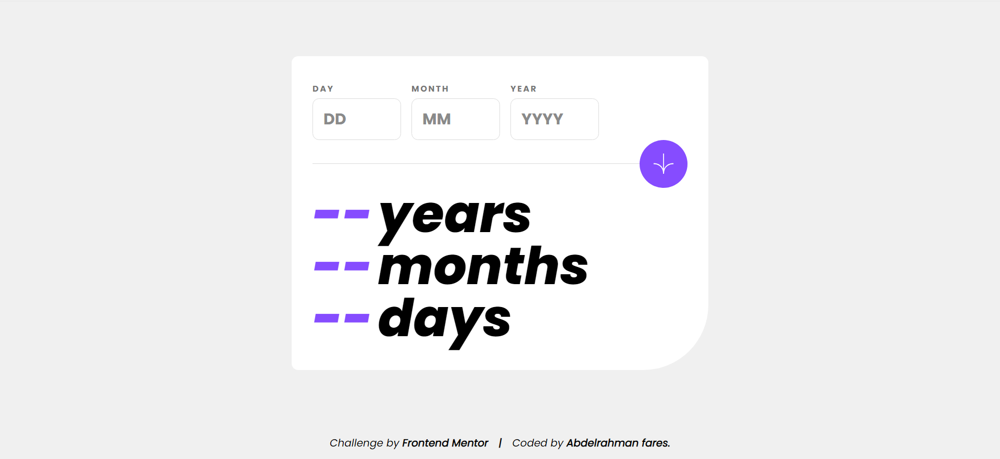

# Frontend Mentor - Newsletter sign-up form with success message solution

This is a solution to the [Newsletter sign-up form with success message challenge on Frontend Mentor](https://www.frontendmentor.io/challenges/newsletter-signup-form-with-success-message-3FC1AZbNrv). Frontend Mentor challenges help you improve your coding skills by building realistic projects.

## Table of contents

- [Overview](#overview)
  - [The challenge](#the-challenge)
  - [Screenshot](#screenshot)
  - [Links](#links)
- [My process](#my-process)
  - [Built with](#built-with)
  - [What I learned](#what-i-learned)
  - [Continued development](#continued-development)
  - [Useful resources](#useful-resources)

## Overview

### The challenge

Users should be able to:

- View an age in years, months, and days after submitting a valid date through the form
- Receive validation errors if:
  - Any field is empty when the form is submitted
  - The day number is not between 1-31
  - The month number is not between 1-12
  - The year is in the future
  - The date is invalid e.g. 31/04/1991 (there are 30 days in April)
- View the optimal layout for the interface depending on their device's screen size

### Screenshot

### Links

- Solution URL: [Solution](https://www.frontendmentor.io/solutions/agecalculatorapp-solution-CmS0Tgx9Bk)
- Live Site URL: [live site URL](https://frontendmentor-age-calculator-app.netlify.app/)

## My process

### Built with

- Semantic HTML5 markup
- CSS custom properties
- Flexbox
- Mobile-first workflow

### What I learned

- How to deal with dates in javascript .

### Continued development

I would like to continue practicing responsive design as it is an important concept . I would also like to practice writing a clean and organized code that other developers can go through and easily understand what it does .

## Author

- GitHub - [bedofares](https://github.com/bedofares)
- Frontend Mentor - [@bedofares](https://www.frontendmentor.io/profile/bedofares)

